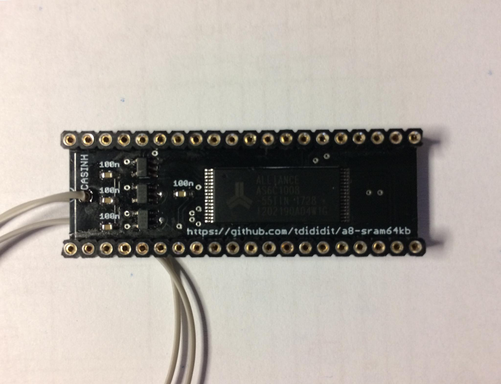

# a8-sram64kb
 Internal 64kB RAM replacement for Atari XL/XE

Installation:
- remove all DRAM chips
- place a8-sram64kb board under CPU - good to replace CPU socket to professional round pin one 
- connect CASINH signal wire to MMU (CO61618) pin 16
- enjoy play with your Atari :)

Ready to use device at [sellmyretro.com](https://www.sellmyretro.com/offer/details/41009)

If you want support my designer fund with small donation, you can do it via [PAYPAL.ME](https://www.paypal.me/tdididit)
